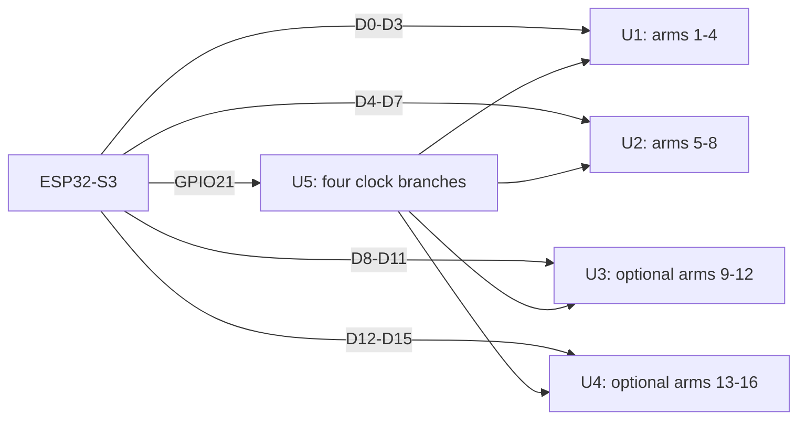

# NASH LPoV: board plan for 8 or 16 arms

> Historical proposal. The rebuilt PCB uses a different pin map; see
> [PCB_PIN_REVIEW.md](PCB_PIN_REVIEW.md) and `BoardPins.h` for the current
> four-arm configuration and findings from the supplied layer images.

**Lay out sixteen independent 144-pixel outputs; populate eight initially.**
Use the ESP32-S3 LCD_CAM bus in 8-bit or 16-bit mode. Each bus bit is one arm's
serial data, with one shared clock fanned out to separate arm clock drivers.
[Espressif I80 interface](https://docs.espressif.com/projects/esp-idf/en/stable/esp32s3/api-reference/peripherals/lcd/i80_lcd.html)

This supersedes the eight-arm-only routing proposal. It is based on the supplied
PCB screenshots and current firmware. Native schematic/PCB files are absent;
connectivity, physical fit and DRC/ERC have not been verified.

## Board and memory pins

The shown header layout matches **YD-ESP32-S3**. Its manufacturer assigns the
RGB LED to **GPIO48**, so **GPIO38 is available**. On the N16R8 octal-PSRAM
version, **GPIO35/36/37 must remain unused by the carrier**; GPIO33/34 are also
memory signals internal to the module.
[YD manufacturer pinout](https://github.com/vcc-gnd/YD-ESP32-S3/blob/main/README.md),
[Espressif module datasheet](https://www.espressif.com/sites/default/files/documentation/esp32-s3-wroom-1_wroom-1u_datasheet_en.pdf)

Confirm the installed module marking. The following are GPIO numbers and
manufacturer header positions, not ESP32 module pad numbers.

## Proposed GPIO map

The first eight retain the previous right-header assignment. The extra eight
mostly use the left header to reduce crossings. U1–U4 each serve four arms.

| Arm / LCD data bit | GPIO | YD header position | Buffer |
|---|---:|---|---|
| 1 / D0 | 1 | P2-4 | U1 |
| 2 / D1 | 2 | P2-5 | U1 |
| 3 / D2 | 42 | P2-6 | U1 |
| 4 / D3 | 41 | P2-7 | U1 |
| 5 / D4 | 40 | P2-8 | U2 |
| 6 / D5 | 39 | P2-9 | U2 |
| 7 / D6 | 38 | P2-10 | U2 |
| 8 / D7 | 47 | P2-17 | U2 |
| 9 / D8 | 4 | P1-4 | U3 |
| 10 / D9 | 6 | P1-6 | U3 |
| 11 / D10 | 7 | P1-7 | U3 |
| 12 / D11 | 15 | P1-8 | U3 |
| 13 / D12 | 16 | P1-9 | U4 |
| 14 / D13 | 17 | P1-10 | U4 |
| 15 / D14 | 18 | P1-11 | U4 |
| 16 / D15 | **45** | P2-15 | U4; boot pull-down required |
| Shared LCD clock | 21 | P2-18 | U5 clock fan-out |
| Reserved LCD D/C | **3** | P1-13 | Local only; boot pull-up |

Reserve GPIO3 from the first build: GPIO4, previously proposed for D/C, now
belongs to arm 9. D/C does not connect to the strips. The future driver must
emit the LED bitstream without LCD command/dummy clocks.

**Retained connections:** SD CLK10, CMD9, D0=8, D1=13, D2=12, D3=11 and
card detect14; Hall5; USB19/20; UART43/44; onboard RGB48. Leave GPIO0/46 out of
the output plan. GPIO39–42 become data outputs, preventing simultaneous use
of external JTAG on those pins.

### GPIO budget and boot resistors

After retaining those peripherals and excluding memory/strapping pins, only
16 exposed GPIOs remain. Sixteen data signals plus clock need 17; reserving
D/C needs 18. This plan therefore deliberately uses GPIO45 and GPIO3:

- **GPIO45: 10 kΩ to GND at the MCU**, connected only to its AHCT input.
  Low selects 3.3 V VDD_SPI when the voltage selection is not overridden by
  eFuse, as needed by the assumed N16R8 module. Do not add a pull-up or let an
  external device drive this net during reset.
- **GPIO3: 10 kΩ to 3.3 V**, local D/C only. High selects USB JTAG when
  strap-based JTAG selection is enabled; default eFuses ignore this strap.
  Its old auxiliary-header connection must not impose a different reset level.

Check the actual module/eFuse configuration and measure reset levels; this
plan does not require burning eFuses.
[Espressif boot configuration tables](https://www.espressif.com/sites/default/files/documentation/esp32-s3_datasheet_en.pdf)

This consumes the otherwise available GPIOs, including the screenshot's
separate "Pin 6" and auxiliary GPIO17/18 connections. Their existing functions
must be identified and repurposed in the native schematic.

If those auxiliary functions must remain, this map needs revision. An
alternative is one-bit SD: free GPIO11/12/13 and use GPIO11 for arm 16 and
GPIO12 for D/C, avoiding both output straps. That requires disconnecting the
repurposed SD nets and measuring the reduced SD throughput; it is not the
preferred four-bit-SD plan.

## Buffer circuit

| Part | Eight-arm population | Sixteen-arm population | Purpose |
|---|---:|---:|---|
| SN74AHCT245, 5 V, TSSOP-20 | U1–U2 | U1–U4 | Four data/clock pairs per chip |
| SN74LVC125A, 3.3 V, TSSOP-14 | U5 | U5 | Four separate clock branches |
| Arm connector: 5V, data, clock, GND | 8 | 16 | One intact strip per connector |
| Series output resistor footprints | 16 | 32 | Start at 33 Ω; tune on scope |
| 100 nF local IC bypass | 3 | 5 | Plus local bulk capacitance |

For each **AHCT245**, wire the four arm pairs as follows:

| Arm within bank | Data: A input → B output | Clock: A input → B output |
|---|---|---|
| First | A1 pin 2 → B1 pin 18 | A2 pin 3 → B2 pin 17 |
| Second | A3 pin 4 → B3 pin 16 | A4 pin 5 → B4 pin 15 |
| Third | A5 pin 6 → B5 pin 14 | A6 pin 7 → B6 pin 13 |
| Fourth | A7 pin 8 → B7 pin 12 | A8 pin 9 → B8 pin 11 |

Pin 20 is +5 V, pin 10 GND, DIR pin 1 tied to +5 V for A-to-B operation,
and /OE pin 19 tied to GND for basic always-enabled operation. Add 10 kΩ
pull-downs on data inputs. Place each output resistor next to its B pin.
[TI AHCT245 datasheet](https://www.ti.com/lit/ds/symlink/sn74ahct245.pdf)

For **U5 LVC125A**, pin 14 is 3.3 V and pin 7 GND. Connect GPIO21 to all
four A inputs (pins 2/5/9/12), with a 10 kΩ pull-down on that common net.
Outputs 3/6/8/11 feed the four clock inputs of U1/U2/U3/U4 respectively.
Tie /OE pins 1/4/10/13 low. Each output is a separate branch; never join them.
[TI LVC125A datasheet](https://www.ti.com/lit/ds/symlink/sn74lvc125a.pdf)

Populate U5 even for eight arms, so all installed banks use the same clock
path. Unpopulated banks leave their branches unloaded. Keep populated buffers
powered whenever driven; independently switched banks need suitable isolation.

The extra clock stage adds delay relative to data. Verify setup/hold timing
and clock polarity at the strips with all banks active. These buffers are a
proposed 16–20 MHz circuit, not a measured speed guarantee.

**Neither /OE nor stopping the clock blanks stored LED colors. Send a complete
black frame after each color frame.**

## Placement and power

Place U1/U2 near the right-side outputs, U3 near the upper left header and
U4 toward the lower centre, where GPIO45 can cross from the right. Keep U5
near GPIO21 with short branches to the banks. Allow room for SD, Hall, USB
access and the antenna keepout.

The screenshots show four output connectors. Reserve **sixteen connector
positions and four buffer banks** now. If they cannot fit on this carrier,
put U3/U4 and their eight connectors on a short local expansion board, using
the same GPIO assignment and continuous ground returns. Do not send long
unbuffered clock/data cables to that board.

Keep 5V/data/clock/GND connector order. Use continuous ground under signals
and stitching vias at layer changes. The final layout may need a larger
outline; screenshots alone do not establish that sixteen ports fit.

At 60 mA/pixel, each arm can draw **8.64 A**, each four-arm bank **34.56 A**,
and sixteen arms **138.24 A / 691.2 W at 5 V**. Size separate fused power
distribution and injection feeds accordingly; ordinary header pins and the
shown shared carrier traces should not be assumed to carry this load.
Power limiting can reduce the design load; blanking reduces average demand,
but does not eliminate on-pulse current.
[Example strip rating](https://www.adafruit.com/product/2241)

Arm numbering is logical. Configure actual angular offsets: at 256 positions,
equally spaced eight-arm and sixteen-arm rotors differ by 32 and 16 columns
per arm respectively. If using a sixteen-position hub with only eight arms,
populate alternate positions and balance the assembly.

## Performance and validation

Parallel wire time stays **471.2 µs for color + black at 20 MHz** for either
population. Sixteen arms at **300 rpm / 16 MHz** leave **192.3 µs** per position
and provide **80 passes/sec**. See [main highlights](ASSESSMENT_8ARM_400RPM.md).

For sixteen lanes, an APA102 transmission occupies 4,712 16-bit DMA words,
or **9,424 bytes**. Two prepared color buffers plus one reusable black buffer
need about **28.3 kB**, before alignment/descriptors; use internal DMA-capable
RAM for this staging. At 400 rpm, color plus black consume about **32.2 MB/s
average DMA traffic**, with **40 MB/s** during a 20 MHz transfer.

A shared 256 × 144 RGB image still occupies **108 KiB**, independent of arm
count. PSRAM holds images; producing sixteen lane streams increases processing
and memory traffic. Schedule prepared black frames independently of SD/Wi-Fi
delays, and benchmark under playback load.

Before fabrication, verify netlist/pad numbers, boot resistors, buffer
orientation, power ratings, fit and DRC/ERC. Bench-check all sixteen electrical
loads, cold boot/reset, SD/USB/Hall operation, DMA continuity and actual
first/last-pixel light pulses. Clock frequency and PWM/latch behavior must be
confirmed on the chosen off-the-shelf strips.

**Documentation only. No firmware or native PCB source has been changed.**
